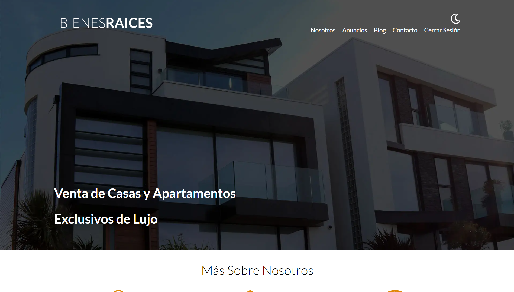
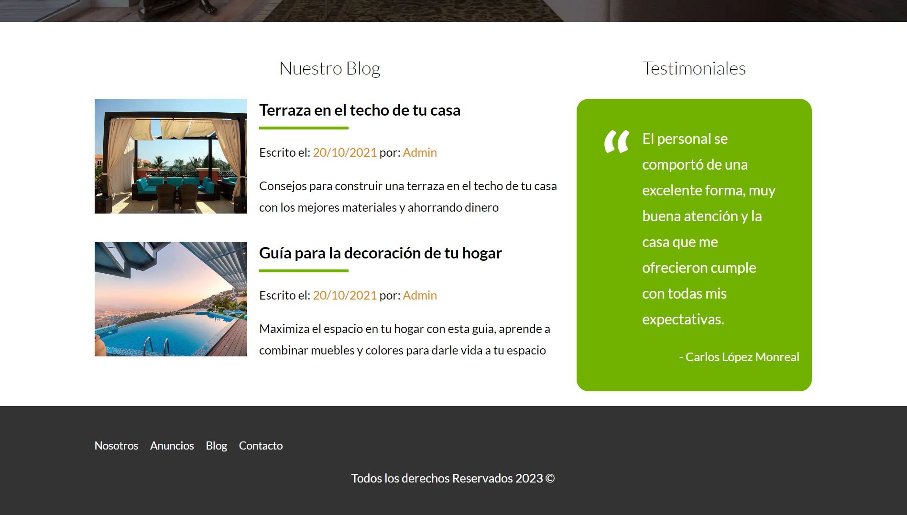
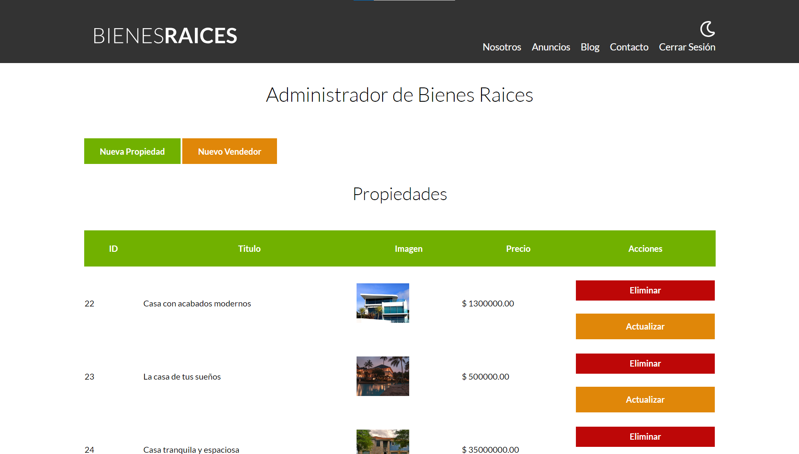

# Venta de Bienes Raíces de lujo
La presente aplicación es un proyecto muy completo donde diseñamos una aplicación para vender alojamientos de lujo. En esta web existen diferentes roles, con el objetivo de tener un perfil con el que poder administrar el contenido de toda la página.

Desde el lado del cliente podemos ver todas las  propiedades que hay disponibles, consumidas directamente desde nuestra base de datos MySQL. Desde el administrador podemos actualizar, crear o eliminar todas las propiedades y sus características.

Por otra parte, tenemos también una sección donde se encuentran testimonios y un blog donde podemos postear diferentes publicaciones con información de interés.

Del lado del cliente, tenemos la vista desde la cuál podemos realizar todas las operaciones para elegir qué mostrar en la web, desde la información de cada una de las propiedades, junto con sus respectivas imágenes, hasta los vendedores de cada una de las mismas.

# Tecnologías utilizadas
    

## Mi nombre es Carlos López 👋🏾
### Software Developer

Me dedico al desarrollo software y en GitHub comparto todos los proyectos que he realizado hasta el momento. Mi objetivo es compartir con la comunidad mi progreso como programador y también mi conocimiento, por si pudiera ser de ayuda.

### Accede a mi perfil para más información
